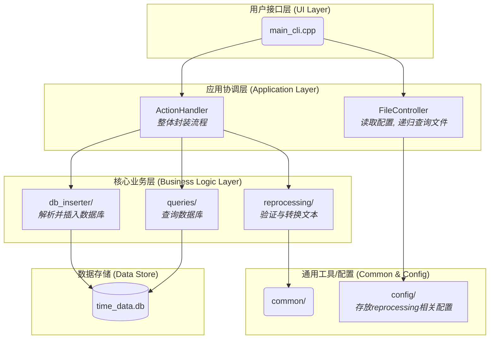

# 依赖项 (Dependencies)

本项目的实现离不开以下这些出色的开源库🚀💪。我向这些项目的开发者们表示感谢🙏❤️！他们的开源库极大地简化了我的开发过程，真是太棒了👍🎉！
本项目依赖于以下优秀的开源库：
* **[SQLite C Library](https://www.sqlite.org/index.html)**
    * **用途**: 数据存储.
    * **许可证**: Public Domain

* **[nlohmann/json](https://github.com/nlohmann/json)**
    * **用途**: 读取配置.
    * **许可证**: MIT License

* **[Matplotlib](https://matplotlib.org/)**
    * **用途**: 用于数据可视化。
    * **许可证**: Matplotlib License (BSD-style)
# 1 Time_Master 
主程序，用于解析文本内容，存入数据库，查询数据库
## 1.1 structure
```
time_master/
├── CMakeLists.txt
├── main.cpp # 交互式
├── main_cli.cpp # 命令行传入
│
├── action_handler/ # 所有功能的封装
│   ├── action_handler.cpp
│   └── action_handler.h
│
├── common/ # Contains shared utilities and data structures used throughout the application.
│   ├── common_utils.cpp
│   ├── common_utils.h
│   └── version.h # for version info
│
├── config/ # 用于存放json配置文件
│   ├── config.json # 用于定于父项目的映射
│   ├── format_validator_config.json # 检验转化后项目名称合法性
│   └── interval_processor_config.json # 转化规则
│
├── db_inserter/ 
│   ├── DataImporterr.cpp  # 封装解析数据与插入数据库      
│   └── DataImporterr.h           
│   └── inserter/
│   │   ├── DatabaseInserter.cpp    # 数据库插入
│   │   └── DatabaseInserter.cpp    # 数据库插入
│   └── model/
│   │   └── time_sheet_model.h      # 共享的结构
│   └── parser/        
│       ├── ParserFactory.h     # 声明创建解析器的工厂
│       └── ParserFactory.cpp   # 实现工厂，封装配置加载和解析器创建的逻辑
│       └── internal/ 
│           ├── DataFileParser.h              
│           ├── DataFileParser.cpp   # 解析数据 
│           ├── ConfigLoader.h       
│           ├── ConfigLoader.cpp     # 加载配置    
│           └── ParserConfig.h    # 读取json配置的父项目映射
│       
│
├── file_handler/ # 预处理的读取文件以及递归查询模块
│   ├── ConfigLoader.cpp # 加载json
│   └── ConfigLoader.h 
│   ├── FileController.cpp # 封装
│   └── FileController.h
│   ├── FileUtils.cpp # 递归查询
│   └── FileUtils.h
│
├── time_master_app/                
│   ├── menu.h           
│   └── menu.cpp         
│
├── queries/             # Contains all logic for querying the database and generating user-facing reports.
│   ├── QueryHandler.cpp    # Implements the QueryHandler class, which acts as a simple interface (Facade) to 
│   └── QueryHandler.h      # Declares the QueryHandler class, the main entry point for all query operations.
│   └── report_generators/
│       ├── query_utils.cpp      
│       └── query_utils.h        
│       └── query_data_structs.h
│       ├── daily/
│       │   ├── DailyReportGenerator.cpp    # (公共接口) 实现了日报生成器
│       │   └── DailyReportGenerator.h      # (公共接口) 声明了日报生成器
│       │   ├── formatter/                # (私有实现) 存放日报的格式化逻辑
│       │   │   ├── DailyReportFormatter.cpp
│       │   │   └── DailyReportFormatter.h
│       │   └── querier/                  # (私有实现) 存放日报的数据查询逻辑
│       │       ├── DailyReportQuerier.cpp
│       │       └── DailyReportQuerier.h
│       ├── monthly/
│       │   ├── MonthlyReportGenerator.cpp    # (公共接口) 实现了月报生成器
│       │   └── MonthlyReportGenerator.h      # (公共接口) 声明了月报生成器
│       │   ├── formatter/                # (私有实现) 存放月报的格式化逻辑
│       │   │   ├── MonthlyReportFormatter.cpp
│       │   │   └── MonthlyReportFormatter.h
│       │   └── querier/                  # (私有实现) 存放月报的数据查询逻辑
│       │       ├── MonthlyReportQuerier.cpp
│       │       └── MonthlyReportQuerier.h
│       ├── period/
│       │   ├── PeriodReportGenerator.cpp    # (公共接口) 实现了查询最近几天
│       │   └── PeriodReportGenerator.h      # (公共接口) 声明
│       │   ├── formatter/                # (私有实现) 存放格式化逻辑
│       │   │   ├── PeriodReportFormatter.cpp
│       │   │   └── PeriodReportFormatter.h
│       │   └── querier/                  # (私有实现) 存放数据查询逻辑
│       │       ├── PeriodReportQuerier.cpp
│       │       └── PeriodReportQuerier.h
│       └── period/
│           ├── PeriodReportQuerier.cpp
│           └── PeriodReportQuerier.h
│
├── reprocessing/               # 预处理
│   ├── LogProcessor.cpp
│   └── LogProcessor.h
│   └── input_transfer/               # 转换验证后的输入文件
│   │   ├── IntervalProcessor.cpp     # 协调器/外观 (负责文件I/O和流程控制)
│   │   ├── IntervalProcessor.h
│   │   └── internal/                   # 内部实现细节
│   │        ├── InputData.h             # 共享数据结构
│   │        ├── IntervalConverter.cpp   # 转换
│   │        ├── IntervalConverter.h
│   │        ├── IntervalProcessorConfig.cpp # 配置加载器
│   │        └── IntervalProcessorConfig.h
│   └── validator/
│       ├── FileValidator.cpp           # 公共接口实现
│       ├── FileValidator.h             
│       ├── ValidatorUtils.cpp          # 共享工具类
│       ├── ValidatorUtils.h            
│       └── internal/                   # 验证内部实现文件夹
│           ├── OutputFileValidator.cpp
│           ├── OutputFileValidator.h
│           ├── SourceFileValidator.cpp
│           └── SourceFileValidator.h
│
└── resources/ # 编译用的图标资源,不是代码
    ├── app_icon.rc
    └── output_icon.ico
```




## 1.2 命令行使用方法
注意程序要在powershell或cmd中运行
### 1.2.1 基本命令格式
```bash
time_tracker_command <command> [arguments]
```
### 1.2.2 可用命令
| 序号 | 短标签 | 长标签 | 功能描述 |
|---|---|---|---|
| 1 | `-vs <path>` | `--validate-source <path>` | 仅检验源文件的格式 |
| 2 | `-c <path>` | `--convert <path>` | 仅转换文件格式 |
| 3 | `-vo`  | `--validate-output` | 转换后检验输出文件 (需与 `-c` 或 `-a` 配合) |
| 4 | `-a <path>` | `--all <path>` | 执行完整流程(检验源->转换->检验输出) |
| 5 | `-edc`  | `--enable-day-check`  | 启用对月份天数完整性的检查 |
| 6 | `-p <filepath>` | `--process <filepath>` | 解析单个已格式化的txt文件并导入数据库 |
| 7 | `-q d <YYYYMMDD>` | `--query daily <YYYYMMDD>` | 查询指定日期的统计数据 |
| 8 | `-q p <days>` | `--query period <days>` | 查询过去指定天数的统计数据 |
| 9 | `-q m <YYYYMM>` | `--query monthly <YYYYMM>` | 查询指定月份的统计数据 |
| 10 | `-h` | `--help` | 查看此使用帮助 |
| 11 | `-v` | `--version` | 查看程序版本和更新日期 |


## 1.3 使用msys2 UCRT64环境进行编译
0. 下载并安装 MSYS2 UCRT64环境(推荐)
MSYS2 是为 Windows 操作系统 设计的

访问 MSYS2 的官方网站：https://www.msys2.org/

选择安装程序：

Download the installer: msys2-x86_64-20250622.exe
1. 执行首次更新
```bash
pacman -Syu
```
2. 安装 UCRT64 开发工具
```bash
pacman -S mingw-w64-ucrt-x86_64-toolchain 
```

3. 安装 CMake
项目使用 CMake 来管理构建过程。继续在 MINGW64 终端中输入以下命令来安装它
```bash
pacman -S mingw-w64-ucrt-x86_64-cmake 
```

4. 安装 nlohmann-json 库
```bash
pacman -S mingw-w64-x86_64-nlohmann-json
```

5. 在环境中运行 build.sh
```bash
./build.sh
```

# 2 graph_generator 图表生成
数据可视化,读取数据库并且生成图表
## 2.1 structure 程序结构
```
graph_generator/
├── main.py                     # 命令行程序入口
├── main_input.py               # input交互
├── db_access.py                # 数据库查询
|
├── configs/
│   ├── heatmap_colors.json     # 热力图颜色配置
│   └── timeline_colors.json    # 时间线和柱状图颜色配置
|
└── modules/
    ├── day_analyzer.py         # 负责处理“逻辑日”数据 (从 timeline_generator 提取)
    ├── heatmap_generator.py    # 通用化的热力图生成器 (合并了旧的 heatmap 和 bool_generator)
    └── plotters.py             # 包含所有基于 matplotlib 的绘图类 (时间线和柱状图)
```
## 2.2 commond 命令总览
1. timeline图表生成
2. 柱状图生成
3. 项目热力图生成
4. 睡眠bool状态生成
## 2.3 基本命令格式
```bash
python main.py <command> [arguments]
```
> **注意**：程序需要在 PowerShell 或 CMD 中运行
> 
## 2.4 可用命令
| 序号 | 命令格式 | 功能描述 |
|------|----------|----------|
| 1 | `timeline <YYYYMMDD>` | 为指定日期生成时间线图 |
| 2 | `barchart <YYYYMMDD>` | 为指定日期生成活动时长柱状图 |
| 3 | `heatmap <year> [-p PROJECT]` | 生成项目热力图（年度+月度） |
| 4 | `sleep <year>` | 生成睡眠状态热力图（年度+月度） |
| 5 | `-h, --help` | 查看使用帮助 |
| 6 | `-v, --version` | 查看程序版本 |

## 2.5 使用示例
### 2.5.1 生成时间线图（命令1）
```bash
python main.py timeline 20250624
```
### 2.5.2 生成柱状图（命令2）
```bash
python main.py barchart 20250624
```
### 2.5.3 项目热力图（命令3）
#### 默认生成项目(mystudy)
```bash
python main.py heatmap 2025
```
#### 指定项目meal
```bash
python main.py heatmap 2025 -p meal
```
### 2.5.4 睡眠bool状态热力图（命令4）
```bash
python main.py sleep 2025
```
### 2.5.4 查看帮助（命令5）
```bash
python main.py -h
```
### 2.6 查看版本（命令6）
```bash
python main.py -v
```

# 3 log_generator 日志生成
txt生成器,用于生成测试数据
## 3.1 structure
/project-root
├── activities_config.json  #配置
├── Config.h                # 配置模块的头文件 (定义数据结构, 声明加载函数)
├── Config.cpp              # 配置模块的源文件 (实现加载函数)
├── LogGenerator.h         #核心逻辑模块的头文件 (定义LogGenerator类)
├── LogGenerator.cpp       #核心逻辑模块的源文件 (实现LogGenerator类)
├── Utils.h                # 工具类头文件，仅含声明
└── main.cpp               #主文件 (包含Application类, Utils实现和main函数)
## 3.2 UCRT64环境编译
1. 在环境中运行 build.sh
```bash
./build.sh
```
## 3.3 usage
```
Description: Generates test log data for a given year range. Reads activities from 'activities_config.json'.
  <start_year>      : The starting year (e.g., 1990).
  <end_year>        : The ending year (inclusive).
  <items_per_day>   : Number of log items per day (positive integer).
  --version         : Display version information and exit.
```
