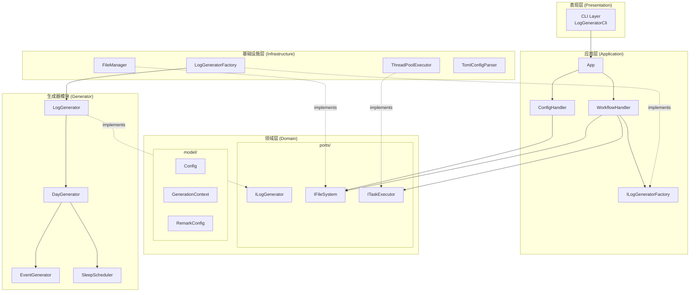
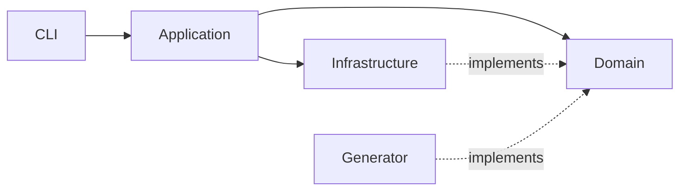
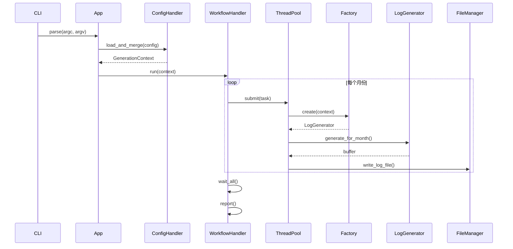

# Log Generator 架构文档

## 概述
`log_generator` 是一个高性能的模拟时间日志生成器，采用 Clean Architecture 分层设计，结合 DDD（领域驱动设计）建模。

---

## 架构图

---

## 层级说明

### 1. Domain 层（领域层）
> **路径**: `src/domain/`

领域层是系统的核心，包含业务逻辑的本质抽象，不依赖任何外部框架或技术细节。

| 子目录 | 职责 |
|--------|------|
| `ports/` | 定义抽象接口，实现依赖倒置原则 |
| `model/` | 定义领域模型（值对象、实体、聚合根） |

**关键组件**:
- `ILogGenerator` - 日志生成器接口
- `IFileSystem` - 文件读写抽象
- `ITaskExecutor` - 任务执行器抽象
- `Config` - 配置值对象
- `GenerationContext` - 生成上下文（聚合根）

---

### 2. Application 层（应用层）
> **路径**: `src/application/`

应用层负责编排用例流程，协调领域对象完成业务场景。不包含业务规则，仅包含流程控制。

| 子目录 | 职责 |
|--------|------|
| `handlers/` | 处理具体用例（配置加载、工作流执行） |
| `factories/` | 定义工厂接口（由 Infrastructure 实现） |

**关键组件**:
- `App` - 应用入口，IoC 容器角色
- `ConfigHandler` - 配置加载与合并
- `WorkflowHandler` - 生成工作流编排

---

### 3. Infrastructure 层（基础设施层）
> **路径**: `src/infrastructure/`

基础设施层提供技术实现，实现 Domain 层定义的接口。

| 子目录 | 职责 |
|--------|------|
| `persistence/` | 文件 I/O、配置解析 |
| `concurrency/` | 线程池实现 |
| `factories/` | 工厂具体实现 |

**关键组件**:
- `FileManager` - 实现 `IFileReader` / `IFileWriter`
- `ThreadPoolExecutor` - 实现 `ITaskExecutor`
- `TomlConfigParser` - TOML 配置解析
- `LogGeneratorFactory` - 创建生成器实例

---

### 4. Generator 模块（生成器）
> **路径**: `src/generator/`

独立的业务模块，负责日志内容的实际生成逻辑。

| 子目录 | 职责 |
|--------|------|
| `components/` | 子生成器（日、事件、备注） |
| `strategies/` | 策略对象（睡眠调度） |

**关键组件**:
- `LogGenerator` - 月度日志生成（实现 `ILogGenerator`）
- `DayGenerator` - 单日日志生成
- `EventGenerator` - 事件生成
- `SleepScheduler` - 通宵日调度策略

---

### 5. CLI 层（命令行界面）
> **路径**: `src/cli/`

表现层，负责用户交互和参数解析。

| 子目录 | 职责 |
|--------|------|
| `framework/` | 通用 CLI 框架（参数解析、帮助格式化） |

**关键组件**:
- `LogGeneratorCli` - 命令行入口
- `ArgParser` - 参数解析器
- `HelpFormatter` - 帮助信息生成

---

## 依赖流向

**规则**:
- 箭头方向表示依赖方向
- 实线 = 编译时依赖
- 虚线 = 运行时实现

---

## 数据流

---

## 命名空间

| 层级 | 命名空间 |
|------|----------|
| Domain | `Domain::Model`, `Domain::Ports` |
| Application | `Application`, `Application::Handlers`, `Application::Factories` |
| Infrastructure | `Infrastructure` |
| Generator | `Generator` |
| CLI | `Cli`, `Cli::Framework` |

---

## 线程安全

- `LogGenerator` 包含 `std::mt19937` 随机数引擎，**不可跨线程共享**
- 每个并行任务通过 `LogGeneratorFactory` 创建独立实例
- `PerformanceReporter` 使用 `std::mutex` 保护累加操作
