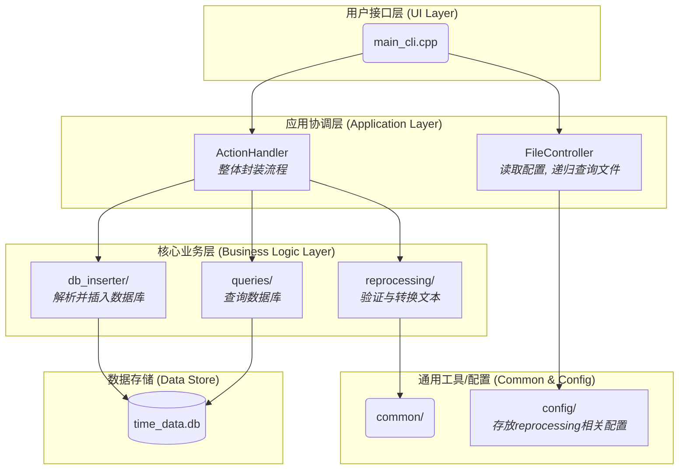

# Time Master 架构与目录结构

本文档详细介绍了 `Time_Master` C++主程序的内部目录结构和高层软件架构。

## 目录结构

```
time_master/
├── CMakeLists.txt
├── main.cpp # 交互式
├── main_cli.cpp # 命令行传入
│
├── action_handler/ # 所有功能的封装
│   ├── action_handler.cpp
│   └── action_handler.h
│
├── common/ # Contains shared utilities and data structures used throughout the application.
│   ├── common_utils.cpp
│   ├── common_utils.h
│   └── version.h # for version info
│
├── config/ # 用于存放json配置文件
│   ├── config.json # 用于定于父项目的映射
│   ├── format_validator_config.json # 检验转化后项目名称合法性
│   └── interval_processor_config.json # 转化规则
│
├── db_inserter/ 
│   ├── DataImporterr.cpp  # 封装解析数据与插入数据库      
│   └── DataImporterr.h           
│   └── inserter/
│   │   ├── DatabaseInserter.cpp    # 数据库插入
│   │   └── DatabaseInserter.cpp    # 数据库插入
│   └── model/
│   │   └── time_sheet_model.h      # 共享日期数据的结构
│   └── parser/        
│       ├── ParserFactory.h     # 声明创建解析器的工厂
│       └── ParserFactory.cpp   # 实现工厂，封装配置加载和解析器创建的逻辑
│       └── internal/ 
│           ├── DataFileParser.h              
│           ├── DataFileParser.cpp   # 解析数据 
│           ├── ConfigLoader.h       
│           ├── ConfigLoader.cpp     # 加载配置    
│           └── ParserConfig.h    # 读取json配置的父项目映射
│       
│
├── file_handler/ # 预处理的读取文件以及递归查询模块
│   ├── ConfigLoader.cpp # 加载json
│   └── ConfigLoader.h 
│   ├── FileController.cpp # 封装
│   └── FileController.h
│   ├── FileUtils.cpp # 递归查询
│   └── FileUtils.h
│
├── time_master_app/                
│   ├── menu.h           
│   └── menu.cpp         
│
├── queries
│   ├── format/                   # 负责报告内部“项目明细”部分的格式化 (策略模式)
│   │   ├── IProjectBreakdownFormatter.h  # 定义项目明细格式化器的通用接口(抽象基类)
│   │   ├── md/                                  # Markdown格式的具体实现
│   │   │   ├── BreakdownMd.cpp
│   │   │   └── BreakdownMd.h
│   │   ├── ProjectBreakdownFormatterFactory.cpp  # “项目明细”格式化器的工厂实现
│   │   ├── ProjectBreakdownFormatterFactory.h    
│   │   └── tex/                                 # LaTeX格式的具体实现
│   │       ├── BreakdownTex.cpp
│   │       └── BreakdownTex.h
│   ├── QueryHandler.cpp                          # 负责解析用户输入的查询命令
│   ├── QueryHandler.h
│   └── report_generators                         # 包含所有高级报告的生成逻辑
│       ├── _shared/                     # -存放被所有报告类型共享的通用代码
│       │   ├── BaseTexFormatter.h              # TeX报告的基类，定义通用文档框架 (模板方法模式)
│       │   ├── query_data_structs.h            # 定义报告所需的数据结构
│       │   ├── query_utils.cpp                 # 通用工具函数(如数据转换)的实现
│       │   ├── query_utils.h
│       │   └── ReportFormat.h                  # 定义报告格式的枚举 
│       ├── AllDayReports.cpp                     # 批量生成所有日报的逻辑
│       ├── AllDayReports.h
│       ├── AllMonthlyReports.cpp                 # 批量生成所有月报的逻辑
│       ├── AllMonthlyReports.h
│       ├── AllPeriodReports.cpp                  # 批量生成所有周期报告的逻辑
│       ├── AllPeriodReports.h
│       ├── daily/                                 # 日报模块
│       │   ├── _daily_data/                     #  日报专用的数据结构
│       │   │   └── DailyReportData.h
│       │   ├── DailyReportGenerator.cpp        #  日报生成器的核心协调类
│       │   ├── DailyReportGenerator.h
│       │   ├── formatter/                       #  日报格式化模块
│       │   │   ├── DayFmtFactory.cpp
│       │   │   ├── DayFmtFactory.h
│       │   │   ├── day_md/                      #  日报的Markdown格式化实现
│       │   │   │   ├── DayMd.cpp
│       │   │   │   └── DayMd.h
│       │   │   ├── day_tex/                     # 日报的TeX格式化实现
│       │   │   │   ├── DayTex.cpp
│       │   │   │   └── DayTex.h
│       │   │   └── IReportFormatter.h          # 日报格式化器的通用接口
│       │   └── querier/                         # 日报数据查询模块
│       │       ├── DailyReportQuerier.cpp
│       │       └── DailyReportQuerier.h
│       ├── monthly/                               # 月报模块
│       │   ├── _month_data/                     # 月报专用的数据结构
│       │   │   └── MonthlyReportData.h
│       │   ├── formatter/                       # 月报格式化模块
│       │   │   ├── IReportFormatter.h
│       │   │   ├── month_md
│       │   │   │   ├── MonthMd.cpp
│       │   │   │   └── MonthMd.h
│       │   │   ├── month_tex
│       │   │   │   ├── MonthTex.cpp
│       │   │   │   └── MonthTex.h
│       │   │   ├── MonthFmtFactory.cpp
│       │   │   └── MonthFmtFactory.h
│       │   ├── MonthlyReportGenerator.cpp      # 月报生成器的核心协调类
│       │   ├── MonthlyReportGenerator.h
│       │   └── querier/                         # 月报数据查询模块
│       │       ├── MonthlyReportQuerier.cpp
│       │       └── MonthlyReportQuerier.h
│       └── period/                                # 周期报告模块
│           ├── _period_data                    # 周期报告专用的数据结构
│           │   └── PeriodReportData.h
│           ├── formatter                       #  周期报告格式化模块
│           │   ├── IReportFormatter.h
│           │   ├── period_md/
│           │   │   ├── PeriodMd.cpp
│           │   │   └── PeriodMd.h
│           │   ├── period_tex
│           │   │   ├── PeriodTex.cpp
│           │   │   └── PeriodTex.h
│           │   ├── PeriodFmtFactory.cpp
│           │   └── PeriodFmtFactory.h
│           ├── PeriodReportGenerator.cpp       #  周期报告生成器的核心协调类
│           ├── PeriodReportGenerator.h
│           └── querier/                         #  周期报告数据查询模块
│               ├── PeriodReportQuerier.cpp
│               └── PeriodReportQuerier.h
│
├── reprocessing/ # 数据验证与预处理               
│   ├── LogProcessor.cpp
│   └── LogProcessor.h
│   └── input_transfer/               # 转换验证后的输入文件
│   │   ├── IntervalProcessor.cpp     # 协调器/外观 (负责文件I/O和流程控制)
│   │   ├── IntervalProcessor.h
│   │   └── internal/                   # 内部实现细节
│   │        ├── InputData.h             # 共享数据结构
│   │        ├── IntervalConverter.cpp   # 转换
│   │        ├── IntervalConverter.h
│   │        ├── IntervalProcessorConfig.cpp # 配置加载器
│   │        └── IntervalProcessorConfig.h
│   └── validator/ # 合法性验证
│       ├── FileValidator.cpp           # 公共接口实现
│       ├── FileValidator.h             
│       ├── ValidatorUtils.cpp          # 共享工具类
│       ├── ValidatorUtils.h            
│       └── internal/                   # 验证内部实现文件夹
│           ├── OutputFileValidator.cpp
│           ├── OutputFileValidator.h
│           ├── SourceFileValidator.cpp
│           └── SourceFileValidator.h
│
└── resources/ # 编译用的图标资源,不是代码
    ├── app_icon.rc
    └── output_icon.ico
```

## 程序架构图

