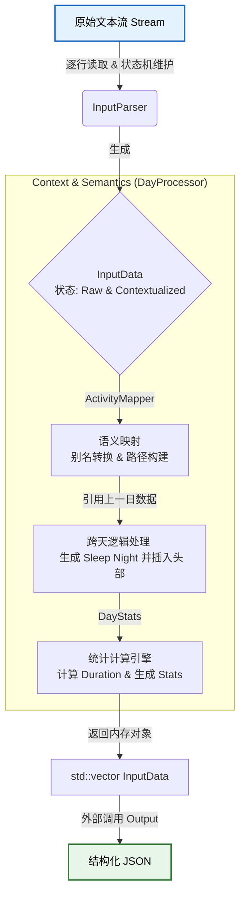

# 架构与模块 (Architecture & Modules)

## 0. 系统分层与职责边界 (System Layers & Responsibilities)

为了确保系统的健壮性与可维护性，系统采用了严格的分层架构，各层职责互不越界。

### 0.1 启动引导层 (Bootstrap Layer)
* **核心组件**: `bootstrap/StartupValidator`
* **职责**: 系统的“门卫”。
    * **环境完整性检查**: 确保所有必要的依赖（如 `reports_shared.dll` 等插件）已就绪。
    * **配置文件加载**: 读取物理配置文件，但不进行深入的业务规则校验。
    * **生命周期控制**: 如果环境不满足运行条件，直接终止程序启动，防止核心业务在不稳定环境中运行。

### 0.2 配置校验层 (Validation Layer)
* **核心组件**: `config_validator/facade/ConfigFacade`
* **职责**: 纯粹的规则验证引擎。
    * **业务规则检查**: 验证加载的 JSON 配置是否符合业务规范（如必填字段、数值范围、颜色格式）。
    * **无状态性**: 只接收数据对象进行判断，不负责 I/O 操作。

### 0.3 核心业务编排层 (Core Orchestration Layer)
* **核心组件**: `action_handler` (计划重命名为 `core`)
* **组件示例**: `WorkflowHandler`, `PipelineManager`
* **职责**: 
    * **信任原则**: 该层**假设**环境是健康的、配置是合法的（由上层保证）。
    * **流程编排**: 专注于调度预处理、数据库转换、报表生成等核心业务逻辑。
    * **数据校验**: 仅关注**用户数据**（如日志内容）的合法性，不关注**系统配置**的合法性。

## 1. 系统概览与数据流 (System Overview & Data Flow)

本系统的核心工作流由两个单向流动的阶段组成：**数据入库 (Data Ingestion)** 与 **报告生成 (Report Generation)**。

### 1.1 第一阶段：数据入库 (Ingestion Phase)

此阶段负责将用户用txt记录的的非结构化内容，转换为结构化数据(json)，并持久化存储到关系型数据库中。

流程：`txt` -> `json` -> `Structs` -> `SQLite`

* **原始解析 (Raw Processing)**:
* **输入**: 用户编写的原始时间日志文本文件 (`.txt`)。
* **处理**: 系统按行读取文本，应用解析规则识别时间戳、活动名称及备注。在此过程中，系统会自动处理业务逻辑（如跨天睡眠的分割、活动时长的计算），并将每日数据标准化。
* **中间产物**: 生成包含完整元数据和统计信息的标准化 **JSON** 对象。

* **持久化 (Persistence)**:
* **处理**: 系统反序列化中间层的 JSON 数据，将其映射为关系模型。
* **存储**: 将结构化数据（日期、项目关系、时间记录）写入 **SQLite** 数据库。项目层级关系在此处以“邻接表”形式存储（父子节点 ID 关联）。

### 1.2 第二阶段：报告生成 (Reporting Phase)

此阶段负责从数据库中提取数据，重建业务模型，并渲染为用户所需的最终格式。

流程：`SQLite` -> `Flat Records` -> `ProjectTree (Memory)` -> `Formatted String(md tex typ)`

* **数据查询与重建 (Query & Reconstruction)**:
* **输入**: 用户的查询请求（如“生成某月月报”）。
* **处理**: 系统根据时间范围查询 SQLite 数据库，获取扁平化的记录列表。随后，系统在内存中将这些零散的记录**动态聚合**，重建为一棵带有统计数据的 **项目树 (Project Tree)**。这棵树在逻辑上等同于一个多层嵌套的 JSON 对象。

* **渲染输出 (Rendering)**:
* **处理**: 渲染引擎遍历内存中的项目树。
* **策略应用**: 根据用户指定的格式（Markdown, Typst, LaTeX），系统加载对应的**格式化策略**。在遍历树节点的同时，策略模块将节点数据转换为目标格式的字符串。
* **输出**: 生成最终的可视化报告文本。

## 2. 预处理模块 (Reprocessing)

### 2.1 数据摄取与预处理层 (Reprocessing Layer)
该层负责将用户手动输入的非结构化时间日志 (TXT) 转换为标准化的结构化数据 (JSON)。它充当了系统的数据入口，确保后续的渲染引擎接收到的是经过校验、清洗且富含语义的数据。

#### 核心组件

* **转换协调器 (IntervalConverter)**
    * **路径**: `reprocessing/converter/facade/IntervalConverter.cpp`
    * **职责**: 作为子系统的 **外观 (Facade)**，封装了从“文件流读取”到“JSON对象生成”的完整复杂性。
    * **机制**: 采用 **管道模式 (Pipeline)**，依次调度解析、加工、统计，严格管理数据在内存中的生命周期。

* **自定义日志解析器 (InputParser)**
    * **路径**: `reprocessing/converter/pipelines/InputParser.cpp`
    * **职责**: 将原始文本流转换为初步的内存对象 (`InputData`)。
    * **核心机制**: **基于行的有限状态机 (Line-based Finite State Machine)**。
        * **非正则实现**: 摒弃低效的通用正则库，采用高效的字符串操作 (`substr`, `find`) 和状态标记（如 `isYearMarker`, `isNewDayMarker`）来追踪上下文。
        * **上下文补全**: 自动维护“当前年份”和“当前日期”状态，允许用户录入时省略重复信息，实现“输入极简，解析精准”。

* **语义映射与处理器 (DayProcessor & ActivityMapper)**
    * **路径**: `reprocessing/converter/pipelines/DayProcessor.cpp`, `ActivityMapper.cpp`
    * **职责**: 负责将“人类语言”转换为“机器语义”。
    * **机制**:
        * **跨天逻辑处理**: 连接上一日与当日的数据，自动计算跨夜睡眠时间 (`sleep_night`)。
        * **活动映射**: 将简写的活动描述（如 `gym`）映射为全限定的项目路径（如 `exercise_anaerobic`），并应用时长修正规则。

* **统计计算引擎 (DayStats)**
    * **路径**: `reprocessing/converter/pipelines/DayStats.cpp`
    * **职责**: 为每一天的数据生成多维度的统计指标。
    * **机制**: 遍历处理后的活动列表，计算绝对时间戳和持续时长；根据配置规则聚合出各类关键指标（如睡眠总时长、深度工作时间），为后续报表提供数据摘要。

### 2.2 数据流动方向与生命周期 (Data Flow & Lifecycle)

本节描述原始日志文本如何经过一系列状态转换，最终成为具备业务价值的统计数据。

#### 核心处理流水线 (Pipeline Visualization)

#### 详细数据演变过程 (Data Transformation Lifecycle)

数据在内存中以 `InputData` 结构体为载体，在流经各个组件时，其内部字段会被逐步填充和丰富。

**1. 阶段一：词法解析与上下文重建 (Lexical Parsing)**

* **执行组件**: `InputParser`
* **输入**: 原始文本行（如 `0800 work` 或 `y2025`）。
* **处理逻辑**:
* **状态机维护**: 解析器内部维护 `current_year` 和 `current_date` 状态。当读取到非日期行时，自动将当前的上下文状态“注入”到该行数据中，解决日志中省略日期的问题。
* **元数据提取**: 识别 `wake_keywords`（如 "起床"），将其对应的时间直接提升为当天的 `getupTime` 字段。

* **数据状态 (Raw State)**:
* `InputData.rawEvents`: 仅包含原始字符串（时间 `0800`，描述 `work`），无时长，无项目路径。
* `InputData.date`: 已被补全为完整格式（如 `20250101`）。

**2. 阶段二：语义映射与标准化 (Semantic Mapping)**

* **执行组件**: `ActivityMapper` (被 `DayProcessor` 首先调用)
* **处理逻辑**:
* **数据清洗**: 执行 `processedActivities.clear()` 确保容器纯净。
* **别名清洗**: 查阅 `TextMapping` 配置，将用户简写（如 `gym`）替换为标准名称。
* **动态时长修正**: 查阅 `DurationMapping`。例如，若活动名为 `read` 但时长小于 15 分钟，系统可能将其自动重映射为 `browsing`。
* **层级路径构建**: 将清洗后的名称转换为层级路径（`project_path`），例如 `study_cpp_reading`。

* **数据状态**: `processedActivities` 被填充，所有元素拥有标准化的 `project_path`，但此时**尚未包含**跨天睡眠数据。

**3. 阶段三：时序连接与跨天逻辑 (Chronological Linking)**

* **执行组件**: `DayProcessor` (Process Phase 2)
* **输入**: `InputData` (已映射的 Current Day) + `InputData` (Previous Day)。
* **处理逻辑**:
* **睡眠推导**: 系统检测到当日 `getupTime` 后，回溯**上一日**的最后一条活动结束时间。
* **合成活动**: 创建 `sleep_night` 活动，起止时间为 `[上一日LastEvent.end -> 当日.getupTime]`。
* **插入队列**: 该合成活动被插入到 `processedActivities` 的**头部** (`begin()`)。

* **数据状态**: 第一条记录现在是跨天睡眠，时间轴完整闭环。

**4. 阶段四：量化计算与指标聚合 (Quantification & Aggregation)**

* **执行组件**: `DayStats`
* **处理逻辑**:
* **原子计算**:
* **Duration**: 计算 `endTime - startTime` 的秒数差。
* **Timestamp**: 将 `YYYYMMDD HHMM` 转换为 Unix 时间戳，作为全局唯一的时间锚点。
* **Logical ID**: 基于日期和序号生成唯一 ID（如 `202501010001`），便于前端索引。

* **指标聚合**: 遍历所有活动，匹配 `StatsRules`。
* 若 `project_path` 匹配 `study*`，则累加到 `studyTime`。
* 若匹配 `exercise*`，则累加到 `totalExerciseTime`。

* **数据状态 (Final State)**: `InputData.generatedStats` 被完全填充，包含了所有用于生成报表的数值概览。

**5. 阶段五：序列化输出 (Serialization)**

* **执行组件**: `Output`
* **处理逻辑**: 丢弃中间过程数据（如 `rawEvents`），仅提取 `processedActivities` 和 `generatedStats`，组装成最终的 JSON 数组。

## 3. db_inserter

## 4. 报表模块 (Reports)

### 4.1 基础设施层
* **配置加载 (ConfigUtils)**
    * **路径**: `reports/shared/utils/config/ConfigUtils`
    * **职责**: 基于 `nlohmann/json` 封装，负责从磁盘读取并解析 JSON 配置文件，为格式化器提供参数。

### 4.2 核心业务层
* **渲染引擎 (ProjectTreeFormatter)**
    * **路径**: `src/reports/shared/formatters/base/ProjectTreeFormatter.cpp`
    * **职责**: 负责将内存中抽象的 `ProjectTree` 数据结构转换为最终的格式化文本。
    * **机制**: 采用策略模式（Strategy Pattern），解耦了“树的遍历逻辑”与“具体格式（Markdown/Typst/LaTeX）的生成逻辑”。