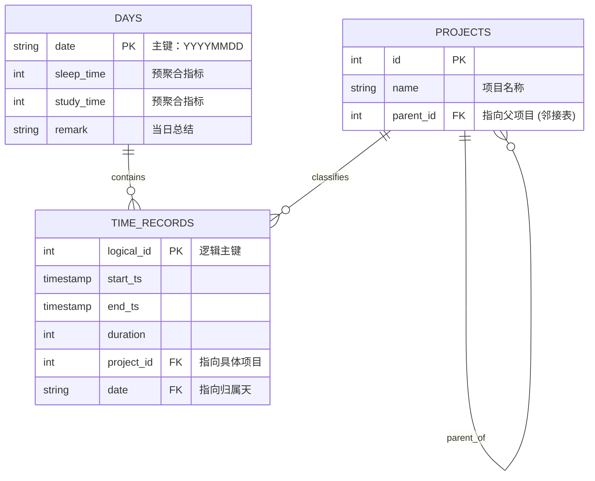

# 时间日志系统核心设计与业务逻辑 (System Design & Core Logic)

**版本**: 0.3.25
**更新日期**: 2026-01-01

## 1. 设计哲学 (Design Philosophy)

本系统的核心目标是实现“个人量化生活（Quantified Self）”的高效闭环。

> **Trace your time, log your life.**

设计遵循以下四大原则：

1. **语法极简主义与认知零负荷 (Syntactic Minimalism)**:
    * **拒绝标记语言**：尽管 LaTeX 或 Typst 对机器解析很友好，但在高频记录场景下，强制用户输入 `\task{name}{time}` 增加用户记录的负担。
    * **类 LRC 的流式体验**：系统采用类似歌词文件 (LRC) 的纯文本行格式。用户只需像写日记一样记录“截止的时间戳 + 内容”。
    * **目标**：将记录的时间成本降至接近于零。用户不需要思考格式，只需倾倒意识流，系统负责后续的结构化清洗。

2. **回顾式结算逻辑 (Retrospective Settlement)**:
    * **截止时间 vs. 开始时间**：大多数时间管理 App 要求记录“开始时间”（预测式），这要求用户时刻预知未来，且容易忘记停止计时。
    * **接力棒机制**：本系统记录**截止时间**（回顾式）。因为“做完”一件事是确定的事实。
    * **连续流假设**：逻辑上，上一件事的**结束**即是下一件事的**开始**。这种“接力棒”式的记录消除了时间碎片，确保了时间轴的连续完整性。

3. * **信息论视角的极致压缩 (Theoretic Minimum Description Length)**:
        * 从信息论角度看，时间流的原子单位仅由 $(t, v)$ 构成。任何额外的标点（如 `{}`、`[]`、`:`）都是语法冗余。
        * 格式 `HHMM Activity` (如 `1000 coding`) 是在保证人类可读性的前提下，对生活日志进行**无损熵编码**的极限形式。
        * 舍弃“秒”级精度是基于生活流信号特性的**去噪处理**，因为人类活动的切换精度通常不在秒级，秒数往往代表记录延迟而非有效信息。

4. **文本主权与可观测流水线 (Text Sovereignty & Observable Pipeline)**:
    * **单一数据源 (Single Source of Truth)**: 
        * 系统坚持 **原始文本文件 (.txt)** 是数据的唯一数据来源，而数据库 (`.sqlite`) 仅作为加速查询和生成报告的**读视图 (Read Model)** 或缓存。
        * **优势**：这种设计赋予了用户对数据的完全掌控权。用户可以使用任何文本编辑器批量修改历史记录，系统通过重新导入 (Re-import) 即可自动同步修正，无需学习复杂的数据库操作指令。
    * **中间态透明化 (Transparent Intermediary)**:
        * 在数据入库前，系统显式地将内部结构体序列化为 **JSON** 格式。
        * **优势**：这不仅是为了持久化，更是为了提供一个**可读的调试层**。用户可以直接查看系统是如何理解原始文本的（例如：查看解析后的具体时间段和分类路径），确保数据在进入数据库之前的准确性与透明度。

---

## 2. 预处理子系统：从文本到语义 (The Reprocessing Engine)

该模块负责将混乱、非结构化的文本流转化为逻辑严密的时间轴数据。

### 2.1 上下文状态流机制 (Contextual State Flow)

为了支持极简输入（即用户不需要每行都写年份和日期），解析引擎被设计为一个**状态保持机**。

* **年份锚点 (Year Anchor)**: 当读取到年份标记（如 `y2025`）时，系统锁定全局上下文年份。后续所有日期均归属该年份，直到遇到新年份标记。
* **日期锚点 (Date Anchor)**: 当读取到日期标记（如 `0101`）时，系统开启一个新的“时间桶（Time Bucket）”。
* **归属原则**: 所有在该日期锚点之后、下一个日期锚点之前的事件，自动继承该日期属性。

### 2.2 跨天时间连续性与睡眠推导 (Time Continuity & Sleep Derivation)

这是本系统最复杂的业务逻辑之一。系统认为**睡眠不是一个主动记录的活动，而是两个清醒周期之间的时间真空**。

#### 逻辑模型

1. **触发条件**: 系统识别到当日的 `Wake Event`（通过配置的起床关键词，如 "起床"）。
2. **回溯链接**: 系统回溯**上一日 (Previous Day)** 的最后一条活动记录。
3. **合成计算**:
* 如果存在上一日数据，且时间逻辑合理（上一日结束时间 < 今日起床时间），系统自动生成一个虚拟的 `sleep_night` 活动。
* **时长 = (今日.起床时间) - (上一日.结束时间)**。
* 如果涉及跨越午夜（24:00），算法需自动处理时间进位（+24小时）。

> **设计意义**: 这种设计防止了用户忘记记录睡眠，同时强制验证了时间轴的连续性。如果上一日数据缺失，今日就无法计算睡眠，从而暴露出数据断层。

### 2.3 三级语义映射漏斗 (The Semantic Mapping Funnel)

为了将随意的用户输入转化为标准的统计数据，活动描述经过三层处理：

1. **标准化映射 (Alias Normalization)**:
* 解决书写随意性。
* *例*: `workout`, `gym`, `举铁`  统一映射为 `exercise`。

2. **动态时长修正 (Duration-based Reclassification)**:
* 解决语义歧义。某些活动通过时长来定义性质。
* *例*: 输入 `reading`。
* 若时长 < 15分钟  系统重判为 `browsing` (随便翻翻)。
* 若时长  15分钟  保持为 `reading` (深度阅读)。

3. **层级路径构建 (Hierarchical Path Construction)**:
* 构建分类树。
* *逻辑*: 将扁平的字符串（如 `study_cpp`）解析为路径 `study` -> `coding` -> `cpp`。这为数据库中的树状索引打下基础。

---

## 3. 存储子系统：关系型建模 (The Storage Model)

该模块负责将内存对象持久化到 SQLite 数据库。设计上采用了**维度建模 (Dimensional Modeling)** 的思想。

### 3.1 实体关系图概念 (Conceptual ER Diagram)

系统并非简单地存储一张大表，而是拆分为三个核心实体，以支持灵活的统计分析。

### 3.2 动态分类树 (Dynamic Taxonomy Generation)

系统不要求用户预先在数据库中配置“项目分类表”。分类树是在数据通过时**动态生长**的。

* **机制**: 当入库引擎遇到一个路径 `study_cs_algo` 时：
1. 检查 `study` 节点是否存在？不存在则创建。
2. 检查 `study` 下是否有子节点 `cs`？不存在则创建，并挂载到 `study` 下。
3. 检查 `cs` 下是否有子节点 `algo`？不存在则创建，并挂载到 `cs` 下。
4. 最终，将时间记录关联到 `algo` 的 ID 上。

* **优势**: 用户的分类体系可以随时演进，无需手动维护数据库字典。

### 3.3 预聚合策略 (Pre-aggregation Strategy)

为了优化查询性能（例如：快速绘制“过去一年的睡眠趋势图”），系统在写入 `DAYS` 表时，不仅仅写入元数据，还写入了**聚合后的统计值**。

* **事实表 (Time Records)**: 存储原子级数据（几点几分做了什么）。
* **汇总表 (Days)**: 存储汇总级数据（当天睡了多久，玩了多久）。
* **写入逻辑**: 解析器在内存中完成一天的处理后，会遍历当天所有活动，根据 `StatsRules` 累加出关键指标（Study Time, Sleep Time, etc.），并在插入 `DAYS` 表时直接写入这些数值。
* **读写分离思想**: 虽然写入变慢了（需要计算），但读取（生成报表）变得极快，因为不需要每次都 `SUM(duration) WHERE date=...`。

---

## 4. 核心校验规则 (Core Validation Rules)

为了保证进入数据库的数据是“干净”的，系统在两个阶段实施了严格的校验。

### 4.1 结构完整性 (Structural Integrity)

* **文件头**: 必须以年份标记开始。
* **块序**: 日期必须包含在年份块内，事件必须包含在日期块内。
* **备注位置**: 当日的 `Remark` 必须位于所有具体活动之前（作为元数据存在）。

### 4.2 逻辑一致性 (Logical Consistency)

* **时间流单调递增**: 同一天内的事件时间戳必须严格递增。不允许“时光倒流”（如 10:00 的活动后紧接着 09:00 的活动）。
* **日期连续性 (Date Continuity)**:
* **连续模式**: 检查从当月1号到当前最新日期的连续性，中间不允许断天。
* **完整模式**: 检查整月数据是否完整（如1月必须有31天数据），用于月末归档检查。

* **最小活动集**: 一天至少包含2个时间点（否则无法计算任何时长）。
