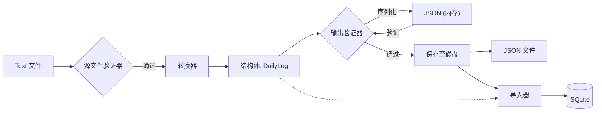

# 核心程序流程 (Core Workflows)

本文档概述了 TimeTracer 应用程序中主要命令的内部数据流向和执行逻辑。

## 1. 全流程流水线 (`run-pipeline` / `blink`)

`run-pipeline` (别名: `blink`) 执行从原始文本摄取到数据库存储的完整数据处理流程。

#### 1.3 配置加载与注入流程 (Configuration Loading & Injection Flow)

为了实现配置格式（TOML）与业务逻辑（Converter）的解耦，系统采用了“解析 -> 中间结构体 -> 注入”的模式。

**数据流向：**
`文件系统 (.toml)` -> **[Config 模块: ConverterConfigLoader]** -> `ConverterConfig (结构体)` -> **[Core 模块: ConverterConfigFactory]** -> `PipelineContext` -> **[Converter 模块]**

**关键逻辑阶段：**

1. **解析与合并 (Config 层)**：
* `ConverterConfigLoader` 读取主配置文件 `config.toml`，并递归合并外部的 `text_mappings`（文本映射）和 `duration_mappings`（时长规则）文件。
* TOML 数据被映射到纯 C++ 结构体 `ConverterConfig` 中，确保业务模块对 `toml++` 等解析库实现零依赖。

2. **运行时参数注入 (Core 层)**：
* `PipelineManager` 触发 `ConverterConfigFactory` 来准备配置实例。
* **动态注入**：工厂类将运行时确定的参数（例如来自 `AppConfig` 的 `initial_top_parents`）直接注入到 `ConverterConfig` 结构体中。
* 这使得转换器保持无状态，无需关心高层应用程序的路径或环境设置。

3. **上下文隔离与传播**：
* 最终确定的 `ConverterConfig` 存储在 `PipelineContext.state` 中。
* 每个流水线步骤（如 `SourceValidatorStep`、`ConverterStep`）从上下文中提取此结构体，并以 `const` 引用的方式传递给底层的执行类（如 `TextValidator`、`LogProcessor`）。

4. **内存化执行**：
* 转换器组件（如 `ActivityMapper`）直接消耗结构体预填充的 Map 和 Vector 来执行转换逻辑。
* 整个过程完全基于内存，与原始的持久化格式（TOML）无关。

### 流程 A: 包含 JSON 持久化 (默认)
当启用 `--save-processed` 或在 `config.toml` 中配置了保存选项时使用此流程。

**数据流向 (Data Flow):**

**执行步骤:**

1. **摄取 (Ingestion)**: Core 读取原始文本文件 (`.txt`)。
2. **源文件验证 (Source Validation)**: Core 调用 **Validator (Text)** 检查结构/语法。
* *检查点*: 如果失败，流水线中止。

3. **转换 (Conversion)**: Core 调用 **Converter** 将文本转换为 **Structs** (`DailyLog` 领域模型)。
4. **输出验证 (Output Validation)**:
* Core 调用 **Serializer** 将 **Structs** -> **JSON (内存对象)**。
* Core 调用 **Validator (JSON)** 检查逻辑完整性（例如：日期连续性）。
* *内存管理*: 临时的 JSON 对象在验证结束后销毁。

5. **持久化 (Persistence)**:
* Core 再次将 **Structs** -> **JSON**。
* 将 JSON 文件写入磁盘 (`output/Processed_Date/`)。
* *内存管理*: JSON 内容从内存中释放。

6. **导入 (Import)**:
* Core 直接将 **Structs** 传递给 **Importer**。
* Importer 将数据写入 SQLite 数据库。

7. **清理 (Cleanup)**: **Structs** 从内存中释放。

### 流程 B: 不包含 JSON 持久化

当指定 `--no-save` 时使用此流程。

**数据流向:**
`文件系统 (.txt)` -> **[源文件验证]** -> **[转换器]** -> `结构体` -> **[输出验证]** -> **[导入器]** -> `SQLite`

**执行步骤:**

1. **摄取**: Core 读取原始文本文件。
2. **源文件验证**: 检查语法。
3. **转换**: 将 文本 转换为 **Structs**。
4. **输出验证**:
* Structs 被临时序列化为 JSON 以应用验证规则。
* JSON 在验证通过后立即销毁。

5. **导入**:
* Core 直接将 **Structs** 传递给 **Importer**。
* Importer 写入 SQLite。

6. **清理**: 释放 Structs。

> **关键设计原则**: `Struct` (`DailyLog`) 是流水线中唯一的**单一事实来源 (Single Source of Truth)**。JSON 被视为验证用的临时格式或归档用的最终产物，但**不**用于向 Importer 传输数据。

---

## 2. 工具命令流程

### 转换命令 (`convert`)

将原始文本日志转换为结构化 JSON 数据。与全流程不同，其主要目标是生成用于调试或人工检查的中间产物。

**关键特性:**

* **强制持久化**: 与 `run-pipeline` 不同，此命令**总是**将结果写入磁盘。如果不这样做，该命令将在内存中执行转换然后立即丢弃结果，不做任何有效工作。

**数据流向:**
`文件系统 (.txt)` -> **[Core]** -> `String` -> **[Converter]** -> `Struct (DailyLog)` -> **[ProcessedDataWriter]** -> `文件系统 (.json)`

**执行步骤:**

1. **初始化**: `ConvertCommand` 强制设置 `AppOptions.save_processed_output = true`。
2. **收集与源验证**: 收集 `.txt` 文件并进行语法验证。
3. **转换 (内存中)**:
* **ConverterService** 逐行解析文本。
* **ActivityMapper** 映射关键字/计算时长。
* **DayStats** 生成统计数据。
* **结果**: 内存中生成 `DailyLog` 结构体集合。

4. **输出验证**: 检查内存中结构体的逻辑。
5. **持久化**: `ProcessedDataWriter` 使用 `JsonSerializer` 将结构体写入 `output/Processed_Data/YYYY-MM.json`。

### 导入命令 (`import`)

将现有的 JSON 文件导入数据库。它遵循解耦的流水线，Importer 模块与文件格式隔离。

**数据流向:**
`文件系统 (.json)` -> **[Core]** -> `String` -> **[Serializer]** -> `Struct (DailyLog)` -> **[Importer]** -> `SQLite`

**执行步骤:**

1. **Core 层**: 扫描目录并将 `.json` 文件读取为字符串。
2. **Serializer 层**:
* 调用 `JsonSerializer::deserializeDays(content)`。
* 将 JSON 字符串转换为 `std::vector<DailyLog>` 领域模型。

3. **Importer 层**:
* 调用 `ImportService::import_from_memory(models)`。
* Importer 接收纯结构体并将其持久化到 `time_data.sqlite3`。
* *注意: Importer 对 JSON 逻辑零依赖。*

---

## 3. 验证流程

质量保证分为两个阶段：格式检查（源文件）和逻辑检查（输出）。

### 源文件验证 (`validate-source`)

检查原始文本文件是否符合配置中定义的语法规则（例如：正确的关键字、时间格式、头部结构）。

**数据流向:**
`文件系统 (.txt)` -> **[Core: FileReader]** -> `std::string` -> **[Validator: TextValidator]** -> `控制台报告`

**关键步骤:**

1. **IO**: Core 读取原始文件内容。
2. **验证**: `TextValidator` 执行两组规则：
* `LineRules`: 检查特定行的语法（例如 "0800 getup"）。
* `StructureRules`: 检查块结构（年份头 -> 日期 -> 事件）。

### 输出验证 (`validate-output`)

在数据成功被 Converter 转换为内存对象*之后*，LogicValidator 接手进行处理。这确保了在存储之前数据的一致性（例如：日期连续性、最小活动计数）。

**数据流向 (内存模式):**
`内存 (Structs)` -> **[Validator: LogicValidator]** -> `控制台报告`

**关键步骤:**

1. **验证**: `LogicValidator` 直接对内部 `DailyLog` 结构体应用逻辑规则：
* **日期规则**: 通过遍历日期列表检查日期缺失（连续性 vs 完整性模式）。
* **活动规则**: 检查对象内部的具体逻辑（如最少活动数量限制）。
* *优势*: 避免了验证阶段不必要的序列化开销，直接利用 C++ 强类型特性进行检查。