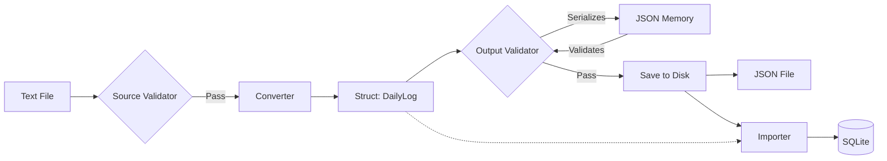

# Core Workflows

This document outlines the internal data flows and execution logic for the primary commands in the TimeTracer application.

## 1. End-to-End Pipeline (`run-pipeline` / `blink`)

`run-pipeline` (alias: `blink`) executes the complete data processing flow, from raw text ingestion to database storage.

#### 1.3 Configuration Loading & Injection Flow

To decouple configuration formats (TOML) from business logic (Converter), the system employs a "Parse -> Intermediate Struct -> Inject" pattern.

**Data Flow:**
`FileSystem (.toml)` -> **[Config Module: ConverterConfigLoader]** -> `ConverterConfig (Struct)` -> **[Core: ConverterConfigFactory]** -> `PipelineContext` -> **[Converter Module]**

**Key Logic Phases:**

1. **Parsing & Merging (Config Layer)**:
   * `ConverterConfigLoader` reads the main `config.toml` and recursively merges external files for `text_mappings` and `duration_mappings`.
   * The TOML data is mapped into a pure C++ `ConverterConfig` struct, ensuring the business modules have zero dependency on `toml++` or other parsing libraries.

2. **Runtime Parameter Injection (Core Layer)**:
   * `PipelineManager` triggers `ConverterConfigFactory` to prepare the configuration.
   * **Dynamic Injection**: The factory injects runtime-specific data (e.g., `initial_top_parents` from `AppConfig`) directly into the `ConverterConfig` struct.
   * This keeps the Converter stateless and unaware of high-level application paths or environment settings.

3. **Contextual Isolation & Propagation**:
   * The finalized `ConverterConfig` is stored in `PipelineContext.state`.
   * Each Pipeline Step (e.g., `SourceValidatorStep`, `ConverterStep`) extracts this struct and passes it as a `const` reference to the underlying worker classes (`TextValidator`, `LogProcessor`).

4. **In-Memory Execution**:
   * The Converter components (like `ActivityMapper`) consume the pre-filled maps and vectors in the struct to perform translations.
   * The process is entirely memory-based and agnostic of the original persistent format.

### Workflow A: With JSON Persistence (Default)
Used when `--save-processed` is enabled or configured in `config.toml`.

**Data Flow:**

**Execution Steps:**

1. **Ingestion**: Core reads raw text files (`.txt`).
2. **Source Validation**: Core calls **Validator (Text)** to check the structure/syntax.
* *Checkpoint*: If failed, the pipeline aborts.

3. **Conversion**: Core calls **Converter** to transform Text into **Structs** (`DailyLog` Domain Models).
4. **Output Validation**:
* Core calls **Serializer** to convert **Structs** -> **JSON (Memory)**.
* Core calls **Validator (JSON)** to check logical integrity (e.g., date continuity).
* *Memory Management*: The temporary JSON object is destroyed after validation.

5. **Persistence (File)**:
* Core converts **Structs** -> **JSON** again.
* Writes JSON files to disk (`output/Processed_Date/`).
* *Memory Management*: The JSON content is released from memory.

6. **Import**:
* Core passes the **Structs** directly to the **Importer**.
* Importer writes data to the SQLite database.

7. **Cleanup**: The **Structs** are released from memory.

### Workflow B: Without JSON Persistence

Used when `--no-save` is specified.

**Data Flow:**
`FileSystem (.txt)` -> **[Source Validator]** -> **[Converter]** -> `Struct` -> **[Output Validator]** -> **[Importer]** -> `SQLite`

**Execution Steps:**

1. **Ingestion**: Core reads raw text files.
2. **Source Validation**: Checks syntax.
3. **Conversion**: Transforms Text -> **Structs**.
4. **Output Validation**:
* Structs are temporarily serialized to JSON for validation rules.
* JSON is destroyed immediately after validation passes.

5. **Import**:
* Core passes **Structs** directly to **Importer**.
* Importer writes to SQLite.

6. **Cleanup**: Structs are released.

> **Key Design Principle**: The `Struct` (`DailyLog`) is the single source of truth throughout the pipeline. JSON is treated as either a transient format for validation or a final artifact for archiving, but it is **not** used to transfer data to the Importer.

---

## 2. Utility Command Workflows

### Convert Command (`convert`)

Transforms raw text logs into structured JSON data. Unlike the full pipeline, its primary goal is to produce intermediate artifacts for debugging or manual inspection.

**Key Characteristic:**

* **Forced Persistence**: Unlike `run-pipeline`, this command **always** writes the result to disk. Without this, the command would perform work in RAM and discard it immediately.

**Data Flow:**
`FileSystem (.txt)` -> **[Core]** -> `String` -> **[Converter]** -> `Struct (DailyLog)` -> **[ProcessedDataWriter]** -> `FileSystem (.json)`

**Execution Steps:**

1. **Initialization**: `ConvertCommand` forces `AppOptions.save_processed_output = true`.
2. **Collection & Source Validation**: `.txt` files are collected and syntactically validated.
3. **Conversion (In-Memory)**:
* **ConverterService** parses text line-by-line.
* **ActivityMapper** maps keywords/durations.
* **DayStats** generates statistics.
* **Result**: A collection of `DailyLog` structs held in memory.

4. **Output Validation**: Checks the logic of the in-memory structs.
5. **Persistence**: `ProcessedDataWriter` uses `JsonSerializer` to write structs to `output/Processed_Data/YYYY-MM.json`.

### Import Command (`import`)

Imports existing JSON files into the database. It follows a decoupled pipeline where the Importer module is isolated from file formats.

**Data Flow:**
`FileSystem (.json)` -> **[Core]** -> `String` -> **[Serializer]** -> `Struct (DailyLog)` -> **[Importer]** -> `SQLite`

**Execution Steps:**

1. **Core Layer**: Scans directory and reads `.json` files into strings.
2. **Serializer Layer**:
* Calls `JsonSerializer::deserializeDays(content)`.
* Converts JSON strings into `std::vector<DailyLog>` domain models.

3. **Importer Layer**:
* Calls `ImportService::import_from_memory(models)`.
* Importer receives pure structs and persists them to `time_data.sqlite3`.
* *Note: Importer has zero dependency on JSON logic.*

---

## 3. Validation Processes

Quality assurance is divided into two stages: Format checking (Source) and Logic checking (Output).

### Source Validation (`validate-source`)

Checks if the raw text files adhere to the syntax rules defined in the configuration (e.g., correct keywords, time formats, header structures).

**Data Flow:**
`FileSystem (.txt)` -> **[Core: FileReader]** -> `std::string` -> **[Validator: TextValidator]** -> `Console Report`

**Key Steps:**

1. **IO**: Core reads raw file content.
2. **Validation**: `TextValidator` runs two sets of rules:
* `LineRules`: Checks specific line syntax (e.g., "0800 getup").
* `StructureRules`: Checks block structure (Year header -> Date -> Events).

### Output Validation (`validate-output`)

Checks the logical integrity of the data *after* it has been parsed into domain models. This ensures data consistency (e.g., date continuity, minimum activity counts) before storage.

**Data Flow (Memory Mode):**
`Memory (Structs)` -> **[Validator: LogicValidator]** -> `Console Report`

**Key Steps:**

1. **Validation**: `LogicValidator` applies logic rules directly on internal `DailyLog` structs:
* `DateRules`: Checks for missing dates (Continuity vs Completeness modes) by iterating through the date list.
* `ActivityRules`: Checks specific logic within `DailyLog` objects (e.g., minimum activity counts).

