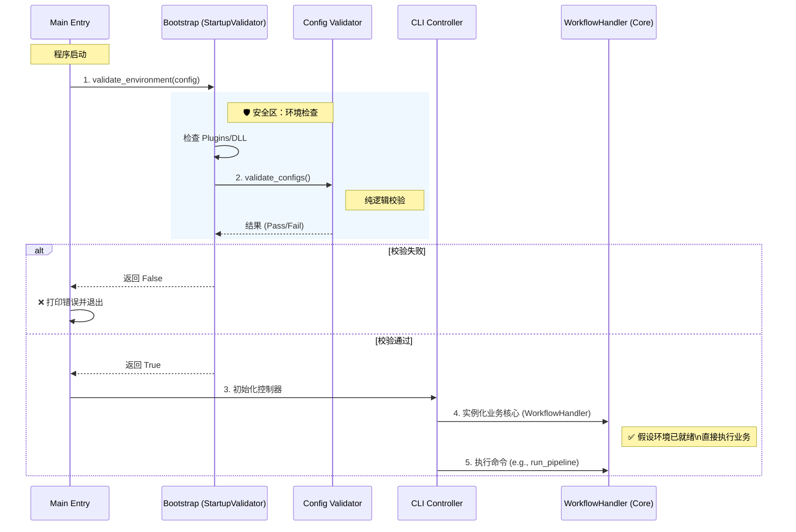

# 核心程序流程 (Core Workflows)

本文档描述了系统在运行时的关键控制流，包括启动引导、依赖验证以及核心业务数据的处理流水线。

## 1. 应用程序启动流程 (Application Startup Flow)

启动过程遵循**“先验证，后执行”**的原则。程序在进入核心业务逻辑之前，会先通过一个严格的引导层（Bootstrap Layer）。

### 1.1 阶段一：环境引导 (Bootstrap Phase)
* **入口**: `main.cpp`
* **执行者**: `bootstrap::StartupValidator`
* **关键动作**:
    1. **加载配置**: 从磁盘读取 `config.json`。
    2. **环境自检**: 检查必要的 DLL 插件（如 `reports_shared.dll`）是否存在。
    3. **配置校验**: 调用 `config_validator` 对配置文件的逻辑（字段存在性、数值范围）进行深度检查。
    4. **决策**: 如果上述任一环节失败，程序将立即终止并打印错误，**绝对不会**进入业务层。

### 1.2 阶段二：核心初始化 (Core Initialization Phase)
* **执行者**: `cli::CliController`
* **动作**: 环境验证通过后，控制器实例化核心服务。
    * **IO 设施**: 初始化 `FileController`。
    * **业务编排**: 初始化 `WorkflowHandler`（原 FileHandler），此时注入已验证的配置对象。

### 1.3 流程可视化
